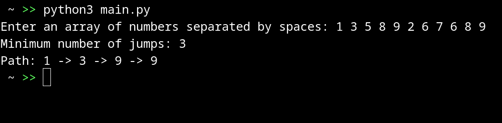

# Jump game

## Description

Defining the minimum number of steps to reach the end of the array, where each element of the array specifies the maximum number of steps that can be taken forward from that position. The program begins by asking the user to enter an array of numbers. It checks the correctness of the input by ensuring that only numbers separated by spaces are entered. The code then calculates the minimum number of hops and builds the corresponding path, given the value of each array element. If the current element is 1, a direct transition occurs to the next element; otherwise, the algorithm chooses the most optimal next step. At the end, the code displays the number of jumps performed and the path of the jumps.

## Example

Simple example here:

## Task logic

- **Task:**

Defining the minimum number of jumps to reach the end of a numeric array, where each element specifies the maximum jump length from its position.

- **Logics:**

Walking through the array to select the optimal next step to minimize the total number of hops, taking into account the possibility of reaching or exceeding the end of the array.

- **Result:**

Prints the minimum number of ***hops*** and sequence of ***steps (path)*** required to reach the end of the array.

## Code

See [**main.py**](./src/bin/app/main.py) file under ***/src/bin/app*** directory.

## Explanation

1. `user_input = input("Enter an array of numbers separated by spaces: ")`
    - Prompts the user to enter a string of numbers separated by spaces.

2. `if " " not in user_input or not user_input.replace(" ", "").isdigit():`
    - Checks whether the entered string contains spaces and whether it consists only of numbers and spaces. If the condition is not met, displays an error message.

3. `arr = list(map(int, user_input.split()))`
    - Converts the entered string to a list of integers. The `split()` method splits a string into elements based on spaces, and `map(int, ...)` converts each element to an integer.

4. `n = len(arr)`
    - Defines the length of the array (number of elements).

5. `if n <= 1: return 0, []`
    - If the array has less than two elements, returns ***0*** hops and an empty path since no traversal is required.

6. Initialization of variables: `jumps = 0`, `current = 0`, `path = []`
    - `jumps` to count jumps, `current` to track the current index, `path` to store the path.

7. `while current < n - 1:`
    - The loop continues as long as the current index is less than the last index in the array.

8. `path.append(arr[current])`
    - Adds the current array element to the path.

9. `if arr[current] == 1:`
    - Checks if the current element is equal to ***1***.

10. `current += 1` and `jumps += 1`
     - If element is ***1***, increases the current index and number of jumps by ***1***, then continues the loop.

11. `next_jump = current + arr[current]`
     - Calculates the index to which you can jump from the current position.

12. `if next_jump >= n - 1:`
     - Checks whether the last element from this jump has been reached or can be reached.

13. `path.append(arr[n - 1])` and `break`
     - If the end of the array is reached, adds the last element to the path and exits the loop.

14. `max_reach = 0` and `next_index = current`
     - Initialization of variables to determine the next step with maximum coverage.

15. Loop `for i in range(1, arr[current] + 1):`
     - Enumerates all possible jumps from the current position.

16. `if current + i < n and current + i + arr[current + i] > max_reach:`
     - Determines whether a jump by a given index increases overall coverage.

17. `max_reach = current + i + arr[current + i]` and `next_index = current + i`
     - Updates the maximum reach and next index for the jump.

18. `if next_index == current:`
     - Checks whether the next step improves the situation.

19. `path.append(arr[n - 1])` and `break`
     - If the next step does not improve the situation, adds the last element to the path and exits the loop.

20. `current = next_index`
     - Updates the current index for the next step.

21. The last lines of code display the result of the function:
     - If the result is a tuple ***(that is, the function returned the number of hops and the path)***, then the program prints these values.
     - If the result is a string ***(error message)***, then the program displays this message.

## License

This project is licensed under the *Apache 2.0* License. See the [LICENSE](LICENSE) file for more details.
